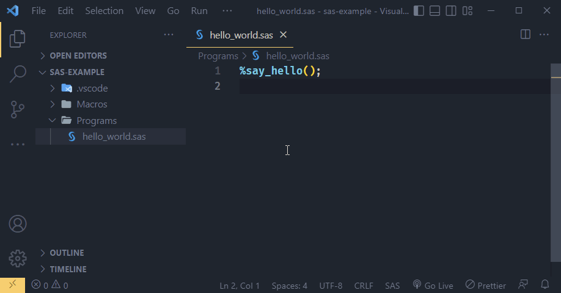

# SAS extension for Visual Studio Code

This extension contributes a definition provider for SAS macros, enabling "Go to Definition" functionality and hover tooltips in the editor.

## Features

Definitions are searched for in the current file, and all `.sas` files in directories listed in the `sas.sasautos` option. The option supports variable substitution for `${workspaceRoot}` to enable relative paths.

The signatures of found macro definitions are shown in the hover tooltip, and the "Go to Definition" is enabled to easily jump to the definition location.

## Requirements

For now, for the extension activates on the "sas" or "SAS" language id, but does not define an association itself. You must have another extension that contributes a SAS language grammar and file association. I use [77qingliu.sas-syntax](https://marketplace.visualstudio.com/items?itemName=77qingliu.sas-syntax).

## Extension Settings

This extension contributes the following settings:

* `sas.sasautos`: Paths to SAS autocall macro libraries. They searched are for macro definitions. Supports variable substitution for `${workspaceRoot}`.
